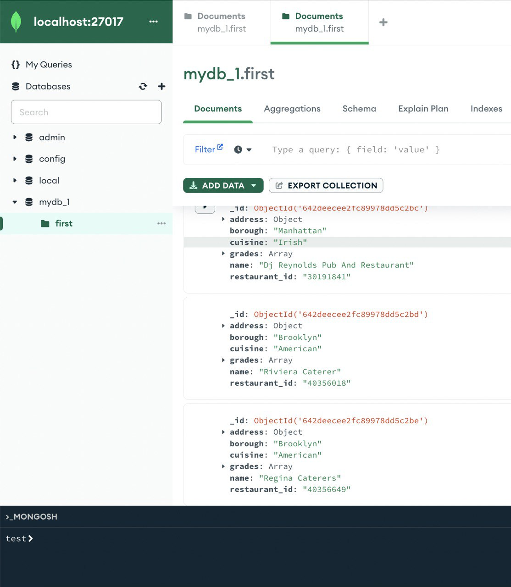
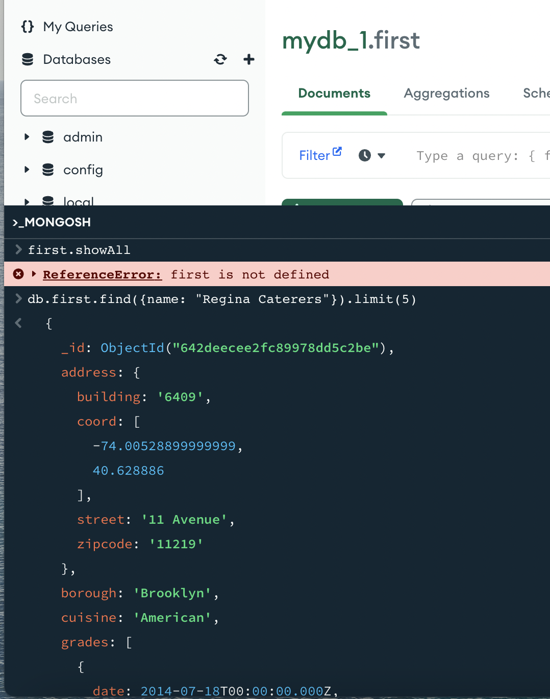
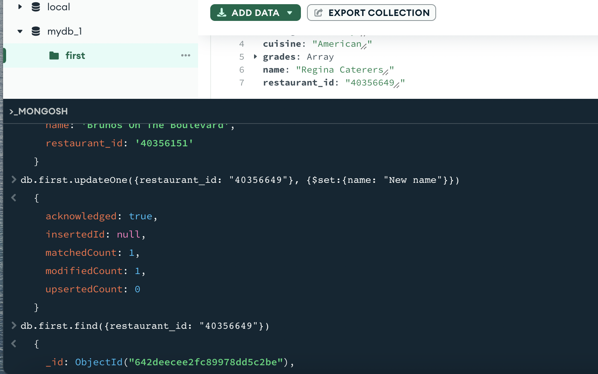
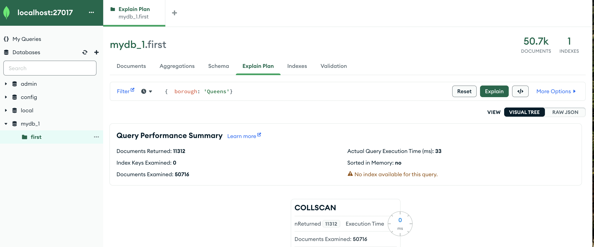
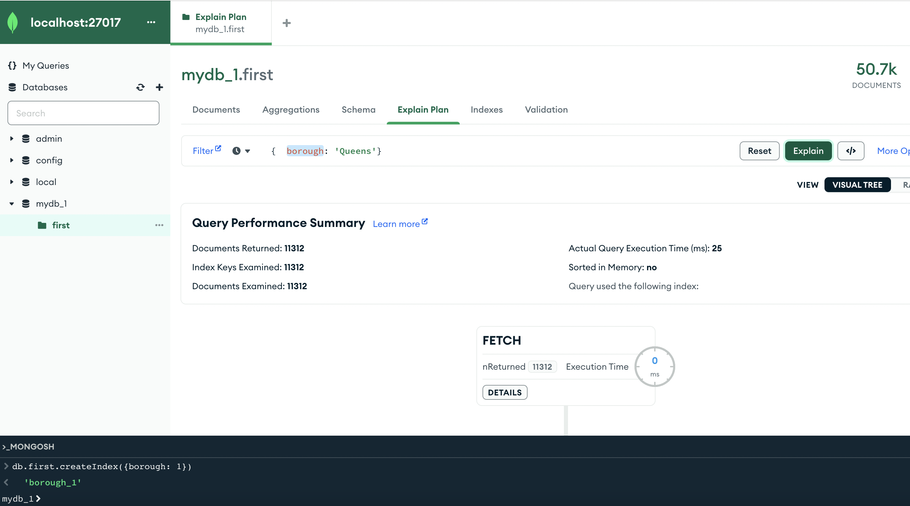

## Базы данных 
### Bogomolov Kirill
#### HW 2

Сначала я скачал установил на локальный компьютер mongodb и её gui.

Далеее я заполнил её базой данных о **ресторанах**:



Подключимся к базе данных в mongosh следующим образом:

```sh
use mydatabase
```

Далее выполним запросы:

<br>

### Read



<br>
<br>

## Update



<br>
<br>

## Delete


<br>
<br>

## Indices

Before:




After:


